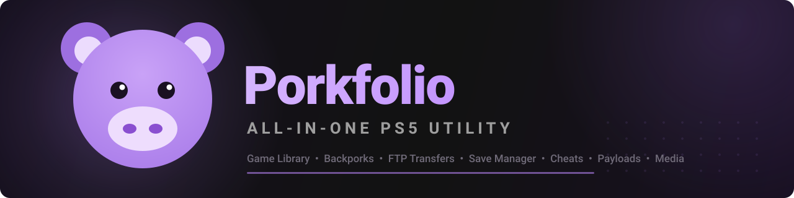

<!-- PROJECT BANNER -->
<p align="center">
  
</p>

<h1 align="center">Porkfolio</h1>

<p align="center">
  <b>All-in-one desktop companion for managing your PS5 game library, backups, FTP transfers, media, payload workflows, saves, avatars, and more.</b>
  <br>
  Built for authorized homebrew and jailbreak workflows on consoles you own.
</p>

<p align="center">
  <a href="#-quick-start">Quick Start</a> ·
  <a href="#-features">Features</a> ·
  <a href="#-first-time-setup">Setup</a> ·
  <a href="#-platforms--builds">Builds</a> ·
  <a href="#-building-from-source">Build from Source</a> ·
  <a href="#-faq">FAQ</a>
</p>

<p align="center">
  
  
  
  
</p>

<p align="center">
  
  
  
  
</p>

<p align="center">
  <a href="../../releases"></a>
  <a href="../../releases"></a>
</p>

> **Important:** Porkfolio is an independent community project, not affiliated with Sony Interactive Entertainment. Use it only with consoles, games, backups, and homebrew you are authorized to use. Features that contact a PS5 require a compatible service or payload already running on that console.

<br>

## ✨ Features

| Module | What it does |
|---|---|
| 🎛️ **Dashboard** | At-a-glance library stats, FTP quick-connect, recent activity, and pinnable widgets. |
| 🎮 **Games** | Scan PS5 game folders, build a library, and enrich entries with ProsperoPatches metadata. |
| 💾 **Backups** | Track local game backups, calculate size, link installs, and verify hashes. |
| 🐷 **Backporks** | Organize firmware-labelled patches and deploy matching folders through FTP. |
| ↕️ **Transfers** | Unified upload, download, install, retry, pause, and progress queue. |
| 📺 **Media** | Browse PS5 screenshots/clips, create thumbnails, download media, and share to Discord. |
| 🃏 **Cheats** | Browse and install compatible cheat collections to a configured PS5 path. |
| 😀 **xAvatar** | Convert images to `.xavatar`, preview them, save locally, or upload through FTP. |
| 💿 **Save tools** | Local save-management and GarlicSaves worker workflows for supported payloads. |
| 🚀 **Payload tools** | Payload downloads, autoloader snapshots, YTJB update helpers, and PS Notify. |
| 🖥️ **System View** | Capture-card preview, recording, GIF export, popout, fullscreen, and hotkeys. |
| 🗃️ **Database** | Local game/backup data with SQL explorer plus CSV and SQL export. |
| 🌐 **Web bridge** | Optional local web UI for supported app actions. |

<br>

## 🚀 Quick Start

### Use a release build

1. Download the build for your operating system from [Releases](../../releases).
2. Start Porkfolio.
3. Open **Settings → FTP Connection** and enter the IP address and port for your authorized PS5 FTP service.
4. Add local backup folders under **Settings → Game Source Folders**.
5. Select **Dashboard → Connect**, then **Scan PS5** to create your library.

### Linux AppImage

```bash
chmod +x Porkfolio-*.AppImage
./Porkfolio-*.AppImage
```

If FUSE is not installed on your distribution:

```bash
./Porkfolio-*.AppImage --appimage-extract
./squashfs-root/AppRun
```

<br>

## ⚙️ First-Time Setup

| Step | In the app | What to configure |
|---:|---|---|
| 1 | **Settings → FTP Connection** | PS5 IP, port list, and credentials if your FTP service uses them. |
| 2 | **Settings → Game Source Folders** | One or more local locations containing backups. |
| 3 | **Settings → Backpork Folders** | Firmware-labelled patch roots, if you use them. |
| 4 | **Settings → Remote Game Paths** | PS5 directories used for game scanning and deployment. |
| 5 | **Settings → Media** | Local media destination and optional Discord webhook. |
| 6 | **Dashboard → Connect** | Establish the FTP connection. |
| 7 | **Dashboard → Scan PS5** | Discover installed games and request metadata. |

<br>

## 🧱 Platforms & Builds

Porkfolio is packaged with Electron Builder for all three desktop platforms:

| Platform | Distribution | Status |
|---|---|---|
| Windows 10/11 | NSIS installer | Supported target |
| macOS | DMG | Supported target |
| x64 Linux | AppImage | Native Linux build and smoke-tested |

### Linux compatibility note

Core application features—desktop UI, local database, FTP, inventory, backups, media, payload tools, saves, xAvatar, and the local web bridge—run on Linux.

The following source workflows intentionally remain Windows-only because they depend on Windows binaries/drivers:

- **FFPKG/UFS2 conversion** uses `UFS2Tool.exe`.
- **ExFAT image creation** uses OSFMount tooling.

On Linux, Porkfolio explicitly reports these limitations instead of allowing an unusable configuration. Raw PFS/FFPFSC workflows remain dependent on their own input and console requirements.

<br>

## 🏗️ Building From Source

### Requirements

- Node.js 18 or newer
- npm
- A graphical desktop session for GUI validation
- A reachable PS5 FTP service only when testing console-connected features

```bash
git clone https://github.com/StonedModder/Porkfolio.git
cd Porkfolio
npm ci
npm test
npm start
```

### Package builds

```bash
# Native Linux AppImage
npm run build -- --linux

# Windows installer (run on Windows or supported CI)
npm run build -- --win

# macOS DMG (run on macOS or supported CI)
npm run build -- --mac
```

Build output is written to `dist/` and is intentionally not committed.

<br>

## 📂 Project Layout

```text
.
├── main.js                         Electron main process and IPC wiring
├── preload.js                      Narrow renderer bridge
├── renderer/                       UI, styles, and feature modules
├── src/                            Database, FTP, services, and IPC handlers
├── build/                          Runtime assets and payload/tool bundles
├── docs/obsidian/Porkfolio/        In-repository user/developer documentation vault
├── PSNotifyModule/                 PS5 notification helper
├── src/xavatarElectronModule/      xAvatar conversion module
└── src/ufs2ElectronModule/         UFS2 module and Windows tooling integration
```

<br>

## ❓ FAQ

<details>
<summary><b>Do I need a jailbreak or payload?</b></summary>

For PS5-facing functions, yes: Porkfolio expects you to have already started a compatible FTP server or the relevant companion payload on a console you own. Porkfolio does not jailbreak or exploit consoles.
</details>

<details>
<summary><b>Does System View need special hardware?</b></summary>

Yes. System View uses a USB capture card detected by the operating system. Capture quality, latency, and available resolutions depend on that hardware.
</details>

<details>
<summary><b>Why are some conversion modes unavailable on Linux?</b></summary>

FFPKG/UFS2 and ExFAT image creation use Windows-only tooling. The Linux app leaves those modes unavailable rather than pretending that Windows executables can run natively.
</details>

<details>
<summary><b>Where is my data stored?</b></summary>

Porkfolio stores its local settings and database in Electron's per-user app-data directory. Keep credentials, save keys, and webhook URLs private; they should never be committed to git.
</details>

<br>

## 📚 Documentation

Open `docs/obsidian/` as an Obsidian vault for linked user and developer notes, including the Linux build/test record and feature matrix.

<br>

## 🤝 Contributing

Keep changes focused and testable. Before opening a pull request:

```bash
npm test
npm run build -- --linux
```

Do not commit credentials, console IPs, save keys, webhooks, tokens, databases, logs, or generated release artifacts.

<br>

## 📜 License

No license was included with the source archive. A license must be selected before accepting outside contributions or redistributing derivative work.

<p align="center">
  <sub>Built for console owners and homebrew enthusiasts.</sub>
</p>
